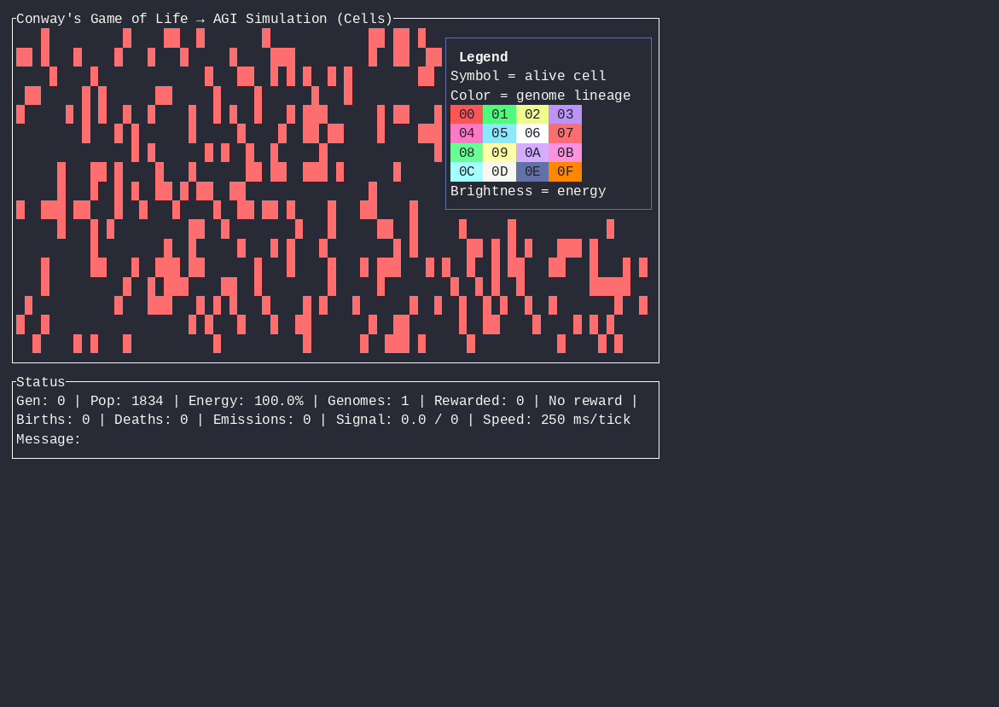

# conway-agi

A terminal-based Conway's Game of Life implemented in Rust, extended with simple artificial-life primitives that make it a starting point for an **AGI simulation** substrate.

## Run

```bash
cargo run --release
```

## Demo



## Controls

| Key | Action |
|-----|--------|
| `q` | Quit |
| `p` / `Space` | Pause / resume |
| `r` | Reset with random seed |
| `n` | Step one generation while paused |
| `c` | Toggle cell / signal view |
| `0-9` | Reward the corresponding signal type |
| `+` / `-` | Increase / decrease speed |
| `m` | Cycle visual theme (Neon → Voxel → CRT) |
| `v` | Switch to Voxel City view |
| `t` | Toggle CRT scanline/glitch overlay |
| `l` | Toggle legend overlay |
| `:` or `/` | Open chat prompt |
| `Esc` | Cancel chat prompt |
| `z` | Force sleep mode |
| `w`/`a`/`s`/`d` | Move player avatar |
| `x` | Query the cell under your avatar (popup with traits/memory/transcript) |
| Mouse left-click on cell | Open cell query popup |
| Mouse left-click on empty | Poke a cell (inject energy/signal) |

## Chatting with the colony

Press `:` or `/` to open a prompt. Type an intent and press `Enter`. The colony will:

1. Reward the matching signal type.
2. Apply a small perturbation (e.g., boost budding, emitting, or resting).
3. Reply after a short window with a symbol and a phrase based on the dominant signal type.

Examples:

```
hello
> Colony replies: ▸ we greet back [greeting]

grow
> Colony replies: ◆ we reach outward [growth]

show me signal 7
> Colony replies: ⚑ we brighten [joy]
```

## Player avatar and RPG-style cell dialogue

Activate the player avatar with `w`/`a`/`s`/`d`. You control a single glowing cell that roams the grid. When your avatar touches or overlaps another live cell, you can talk to it with `:`/`/`. Each cell has:

- **Traits and memories** inherited from its genome, emotional state, and lifetime experiences.
- A **dialogue transcript** recording what you said to it and what it replied.
- An **LLM responder** (configurable via `OPENAI_API_KEY` or local endpoint) that generates in-character replies based on the cell's genome, state, memory, attachment preferences, and recent events.

Cells remember every interaction and will reference prior conversations in future replies. This turns the substrate into a lightweight RPG where the player explores an evolving society of emotional, memory-bearing cells.

### Enabling LLM-backed dialogue

By default cells reply with symbolic in-character echoes. To use a real LLM (OpenAI-compatible), build with the `llm` feature and set your API key:

```bash
cargo build --release --features llm
OPENAI_API_KEY=sk-... cargo run --release --features llm
```

You can also point to a local endpoint:

```bash
OPENAI_BASE_URL=http://localhost:1234/v1 OPENAI_MODEL=llama3 cargo run --release --features llm
```

The responder sends the cell's name, emotional state, age, energy, signal type, attachment preferences, memory byte, and recent transcript to the model, asking for a short in-character reply.

## Cell states and memory

Each live cell tracks an emotional state and a memory of recent experiences:

| State | Trigger |
|-------|---------|
| `Calm` | Peace outweighs agitation and violence |
| `Anxious` | Negative reward, crowding, nearby stress, low energy |
| `Angry` | High violence + nearby violence |
| `Sleepy` | High energy + peace |
| `Passion` | Positive reward + high energy + budding attachment |
| `Quietude` | High peace + resting attachment + solitude preference |

Cells remember trauma, harm, and soothing events. Their preferences (attachments) for budding, emitting, resting, crowds, and solitude are inherited from parents and reinforced by experience. A small constant randomness adds noise to every cell's action selection.

## Sleep and poke

- **Sleep mode**: after 120 seconds of no input, the simulation slows to one tick every 2 seconds and dims the display. Press any key or move the mouse to wake it.
- **Poke**: left-click a cell to inject energy and signal. Alive cells are soothed and re-energized; dead cells are reborn.

## What is special about this Game of Life?

- **Conway rules remain intact**: cells with 2-3 neighbors survive; dead cells with exactly 3 live neighbors are born.
- **Energy metabolism**: every live cell pays a metabolic cost each tick. Crowded cells pay more. Well-supported cells gain energy through "photosynthesis". Cells that hit zero energy die of starvation.
- **Genome inheritance**: when a cell is born, it inherits a genome tag from its three parents. If parents disagree, the majority wins; ties are resolved randomly and mutations can occur. This creates lineages and selection pressure.
- **Active reproduction**: cells can bud into empty neighbors when they have surplus energy, independent of the strict Conway birth rule.
- **Chemical signals**: a parallel signal grid diffuses and decays. Cells emit signals based on their genome and read local signal levels.
- **Per-cell brain + human RL**: each cell has four weights that map energy, neighbors, signal, and reward to one of three actions (bud, emit, rest). Humans press `0-9` to reward signal types. Brains update in real time and are inherited with mutation.
- **Human-readable message decoder**: the dominant signal type each tick is mapped to a symbol, producing a rolling "message" in the status bar.

These additions turn the simulation from pure cellular automata into a minimal **human-in-the-loop evolutionary intelligence substrate**.

## Architecture

- `src/cell.rs` — Cell state, genome, brain weights, emotional states, memory, attachment preferences.
- `src/grid.rs` — Toroidal grid and neighbor queries.
- `src/rules.rs` — Conway step, budding, signaling, brain action selection, reinforcement, state transitions.
- `src/signal.rs` — Diffusable chemical signal grid.
- `src/reward.rs` — Human reward channel.
- `src/decoder.rs` — Signal-to-symbol message decoder.
- `src/chat.rs` — Intent parser, symbolic reply generator, and LLM dialogue client.
- `src/avatar.rs` — Player avatar cell that roams the grid.
- `src/simulation.rs` — Buffers, tick loop, aggregate statistics, decoder update, poke, dominant state, avatar, cell transcripts.
- `src/tui.rs` — ratatui terminal interface, chat input, sleep mode, mouse poke, visual modes.
- `src/ui/` — Theme, grid renderer, HUD, legend, effects (cyberpunk visual system).

## Roadmap to a real AGI simulation

See [`docs/AGI-SIMULATION.md`](docs/AGI-SIMULATION.md) for a step-by-step design for evolving this substrate toward artificial general intelligence.
